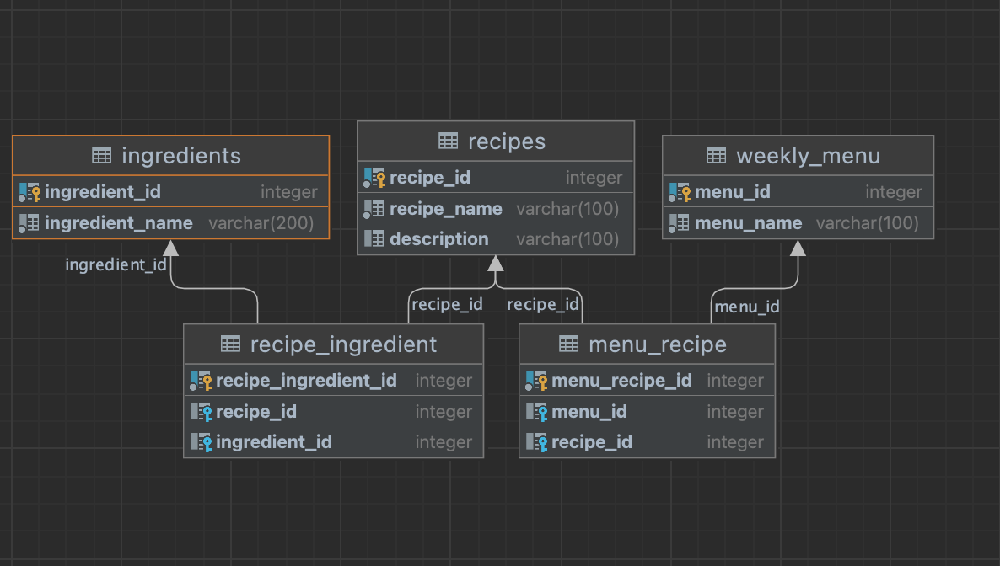

##Weekly Menu Manager
Weekly-Menu manager is the backend API service to manage all operations related to creating, updating, deleting & managing weekly menus.

###Data Models:

****1. weekly-menus****:A menu created weekly consisting of x recipes.

****2. ingredients****: It defines ingredients used in recipes.

****3. recipes****: It defines a recipe.


****4. recipe-ngredients****: It defines the relationship between recipes and ingredients (the ingredients required to create a recipe).

****5. Menu-recipe**** : It defines the relationship between menu and recipes (the recipes required to create a menu).


###API design:
Endpoints and its major responsibilities below.

1. ****recipes****
- ```/recipes/``` - creating & updating recipe
- ```/recipes/<recipe_id>``` - deleting recipe by id & listing recipe by id
2. ****Ingredients****
- ```/ingredients``` - creating and updating ingredient and listing all ingredient
- ```/ingredients//<ingredient_id>``` - deleting ingredient by id & listing all ingredients by id
3. ****WeeklyMenu****
- ```/weeklymenu``` - creating  and updating weekly menu
- ```/weeklymenu/<menu_id>``` - deleting weekly menu by id and listing weekly menus by id
4. ****menu_recipe****
- ```/menu-recipe``` - creating and updating menu recipes and listing all recipes
- ```/menu-recipe/<menu_recipe_id>``` - deleting recipe by menu_recipe_id
- ```/menu-recipe/<menu_id>/recipes``` - listing all recipes present in menu by menu id
5. ****recipe-ingredient****
- ```/recipe-ingredient``` - creating and updating recipe and listing all recipes
- ```/recipe-ingredient/<recipe_id>/ingredient``` - list all ingredient ids in recipe by recipe id
- ```/recipe-ingredient/<recipe_ingredient_id>``` - delete ingredient by recipe-ingredient id

### Prerequisites ###

- Python version 3.7+
- pip3
  - Navigate to the root folder of the project on the terminal
  - Run -> sh scripts/activate.sh
  - Once the venv is activated, Run -> sh scripts/run_tests.sh
- Create virtualenv ```venv```
- Node latest version to run postman collection

#### To setup the project and run locally
 ```make run-local```

####To run tests ###:
```make local-test-setup```
```make test-unit```


####To run postman collection ###: 
```make run-postman-collection```

### SQL table structure ###

